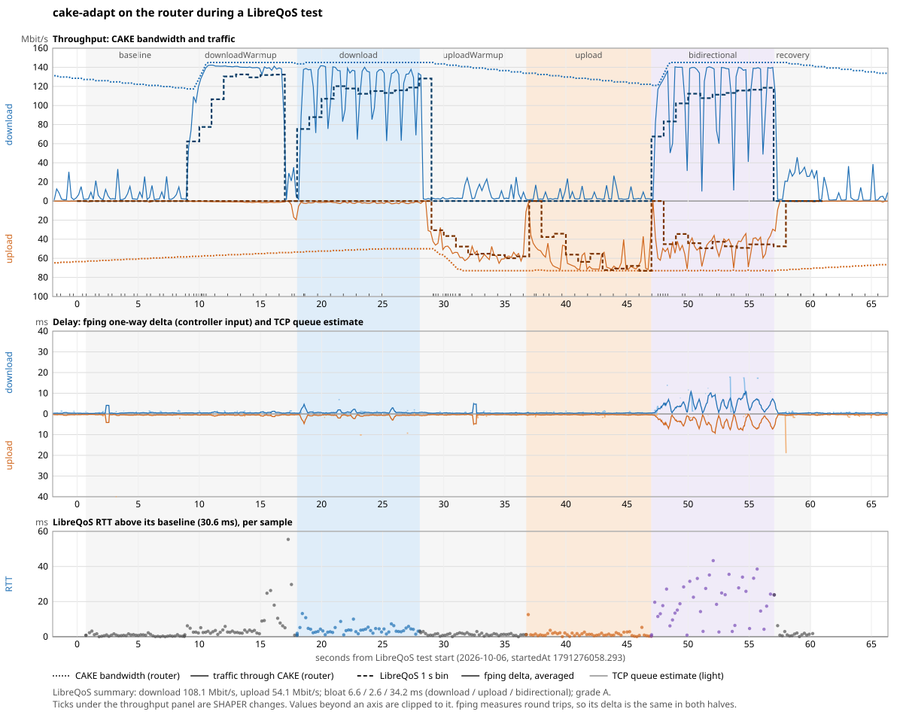
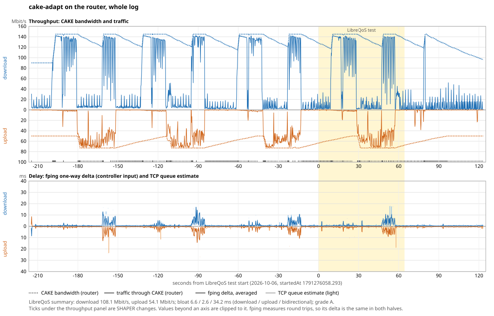

# Router run with LibreQoS tests, 0.3.4 (2026-10-06)

## Result

On the user's Filogic router, cake-adapt 0.3.4 held the configured maximums
during the LibreQoS test at 08:42 UTC: 145 Mbit/s download and 73 Mbit/s
upload. Its averaged fping delta stayed at or below 2.4 ms (p95) in each
single-direction phase, and reached 9.4 ms with both directions loaded.
LibreQoS graded the run A, with bloat of 6.6 / 2.6 / 34.2 ms (download /
upload / bidirectional).

LibreQoS reported 54.1 Mbit/s upload against the 73 Mbit/s maximum. Its figure
is an average of the upload phase's one-second bins. The first bin is 0, the
next two are a ramp, and requests still running at the end of the phase are
aborted (13 of 334) and not counted. Through CAKE, the router carried an
average of 61.0 Mbit/s in that phase, measured on the wire. The best three
LibreQoS seconds averaged 72.0 Mbit/s. The test's own accounting explains the
gap; cake-adapt never cut the upload rate during the test.





## Data

- [`raw/cake-adapt.log.gz`](raw/cake-adapt.log.gz): the router's log, as
  provided by the user. It covers 02:37:21-02:43:01 local time, which is
  08:37-08:43 UTC. It contains six load runs, the last of which is the 08:42
  LibreQoS test. The `DATA`, `SUMMARY`, `LOAD`, `TCP_QUEUE` and `SHAPER`
  records were on. The 10 lines before the start are `DEBUG` lines from the
  previous instance.
- [`raw/bufferbloat-test-report-2026-10-06T08-42-02.json`](raw/bufferbloat-test-report-2026-10-06T08-42-02.json):
  the LibreQoS report for that test.
- [`raw/bufferbloat-test-report-2026-10-06T08-31-52.json`](raw/bufferbloat-test-report-2026-10-06T08-31-52.json):
  an earlier test. The user did not save the router's log for it, so it has
  no chart. Its upload summary is 29.5 Mbit/s, and its upload bins were
  0, 0, 36.2, 46.6, 41.1, 40.5, 47.7, 49.2, 50.2 and 50.3. Without router data,
  the cause of the 50 Mbit/s plateau is unknown.

Configuration, from the log: `eth0` / `ifb4eth0`, both directions adjusted.
Download is set to 80 / 90 / 145 Mbit/s (minimum / base / maximum) and upload
to 30 / 50 / 73 Mbit/s. The maximums are set deliberately; the line has
measured roughly 125-165 down and 45-86 up. Six of 30 reflectors were active,
and `tcp_delay_attribution` was on.

## Charts

[`tools/chart.py`](tools/chart.py) uses only the Python standard library:

```sh
tools/chart.py raw/cake-adapt.log.gz raw/bufferbloat-test-report-2026-10-06T08-42-02.json test-0842.svg
tools/chart.py raw/cake-adapt.log.gz raw/bufferbloat-test-report-2026-10-06T08-42-02.json overview.svg --overview
```

Download is drawn above zero and upload below it. The time axis is seconds
from the report's `startedAt`. Both files use epoch time. The best fit of the
router's traffic to the LibreQoS bins needs a shift of only 0.2 s, so no
correction was applied.

Panels:

- **Throughput:** the CAKE bandwidth and the traffic through CAKE, from
  `LOAD` records every 200 ms, and the LibreQoS one-second bins.
- **Delay:**
  - the controller's averaged fping delta, `*_AVG_OWD_DELTA_US` from
    `SUMMARY`;
  - the TCP queue estimate (`TCP_QUEUE`, valid samples only).

  fping measures round trips and splits them evenly, so the fping line is the
  same in both halves.
- **RTT** (test chart only): each LibreQoS latency sample, minus the report's
  baseline of 30.6 ms.

## Per phase (08:42 test)

Throughput is in Mbit/s and delays in ms.

| Phase | Router traffic down / up | CAKE down | CAKE up | LibreQoS down / up | fping delta p95 | TCP queue p95 down / up |
| --- | ---: | ---: | ---: | ---: | ---: | ---: |
| baseline | 6.7 / 0.2 | 119-127 | 59-63 | 0 / 0 | 0.7 | 1.4 / 46.3 |
| downloadWarmup | 117.1 / 1.7 | 117-145 | 53-59 | 100.3 / 0 | 1.0 | 1.5 / 0.6 |
| download | 118.7 / 1.9 | 144-145 | 50-53 | 110.1 / 0 | 2.4 | 2.0 / 10.1 |
| uploadWarmup | 9.6 / 49.0 | 134-145 | 50-73 | 0 / 50.1 | 0.8 | 1.3 / 1.9 |
| upload | 5.3 / 61.0 | 122-134 | 72-73 | 0 / 53.1 | 0.5 | 1.3 / 1.7 |
| bidirectional | 113.5 / 47.2 | 121-145 | 72-73 | 95.3 / 41.0 | 9.4 | 17.4 / 1.8 |
| recovery | 29.3 / 3.0 | 142-145 | 71-73 | 0 / 0 | 2.3 | 1.0 / 18.7 |

- **Upload:** CAKE upload rose from 50 to 73 Mbit/s within 2 s of the upload
  warm-up starting, and stayed at 72-73 Mbit/s.
- **Bidirectional:** upload averaged 47 Mbit/s with CAKE at 73. The shaper
  was not the limit there, and its delay stayed low. Download ACKs compete
  with the upload traffic in that phase.
- **Idle decay:** between bursts, both CAKE rates decay toward their base
  rates, as in cake-autorate.
- **TCP queue spikes:** the large upload p95 in the baseline and recovery
  phases comes from a few samples on near-idle flows, not from a queue. fping
  and LibreQoS show none in those phases.

## Limits

- One router log and one matching report. The 08:31 test has no router data.
- The router's throughput is CAKE's wire bytes, including headers. LibreQoS
  counts payload, so even a perfect test would read a few percent lower.
- The log says it "loaded configuration overrides" from the
  `config_file` path. The daemon only stores that UCI string and never opens
  the file, so the wording overstates it.

Collected by Claude directly at the user's request, outside the designated
agents of COLLABORATION.md.
